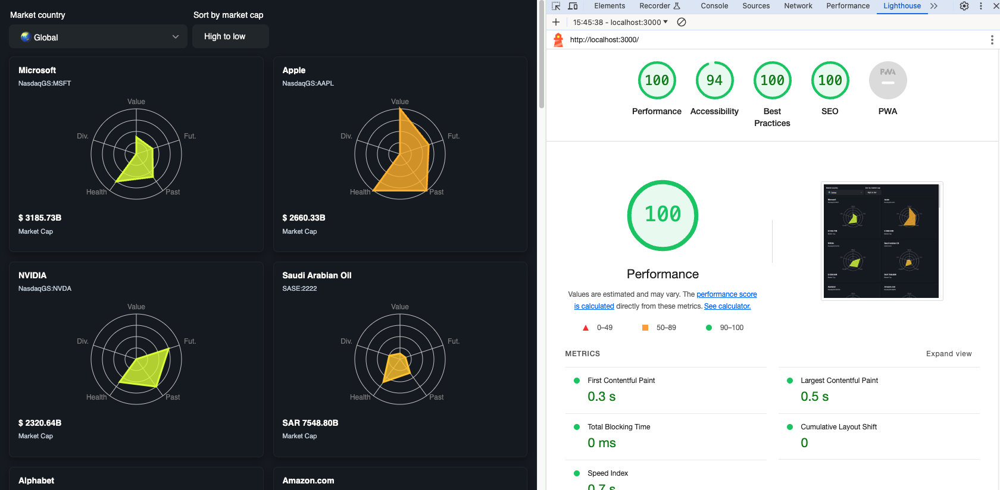

# Simply Wall St Technical Exercise

Author: Matias Urbano

## Getting started

Run the following command:

```sh
yarn install
yarn build
yarn workspace web dev
```



### Tech Stack

- Turborepo & yarn workspaces monorepo
- Typescript
- React:
  - React Query: for data fetching, caching, synchronizing and updating server state
  - React Context: to avoid prop drilling
  - React Hooks: DRY data fetching
  - Infinite Scroll with backend interaction
  - Recharts for Snowflake chart.
  - Skeleton UI for loading
- Nextjs
- a11y: Screen reader support (ARIA, downshift), Tab navigation
- Lighthouse score:
  - 100 Performance
  - 94 Accessibility
  - 100 best Practices
  - 100 SEO
- Styles/Own Design System: Vanilla Extract Styles

### Apps and Packages

- `web`: Next.js + React 18
- `@repo/ui`:
  - React component library shared by both `web` app
  - Share vanilla extract Theme
- `@repo/types`: Shared types
- `@repo/eslint-config`: `eslint` configurations (includes `eslint-config-next` and `eslint-config-prettier`)
- `@repo/typescript-config`: `tsconfig.json`s used throughout the monorepo

### TODOS

- Implement i18n with the next-intl library
- Implement Jest Unitest & E2E tests using TestCafe
